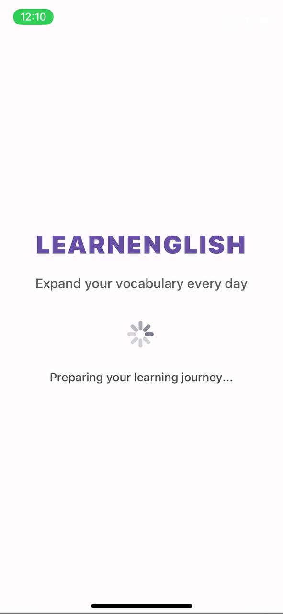
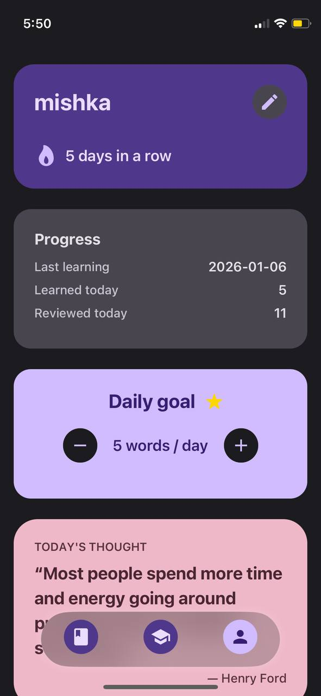
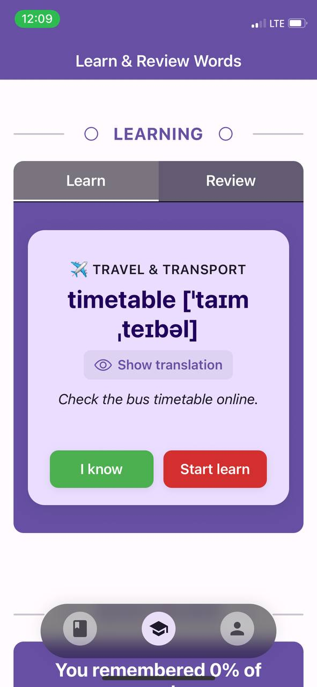
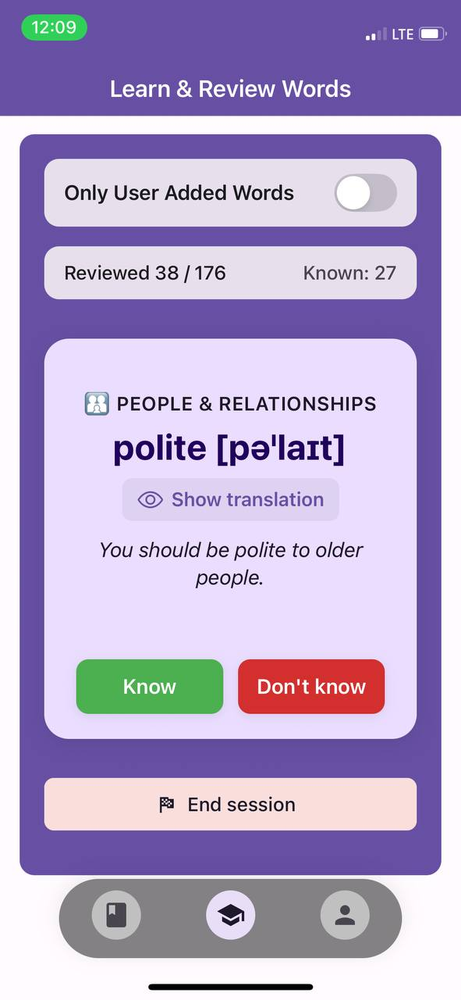
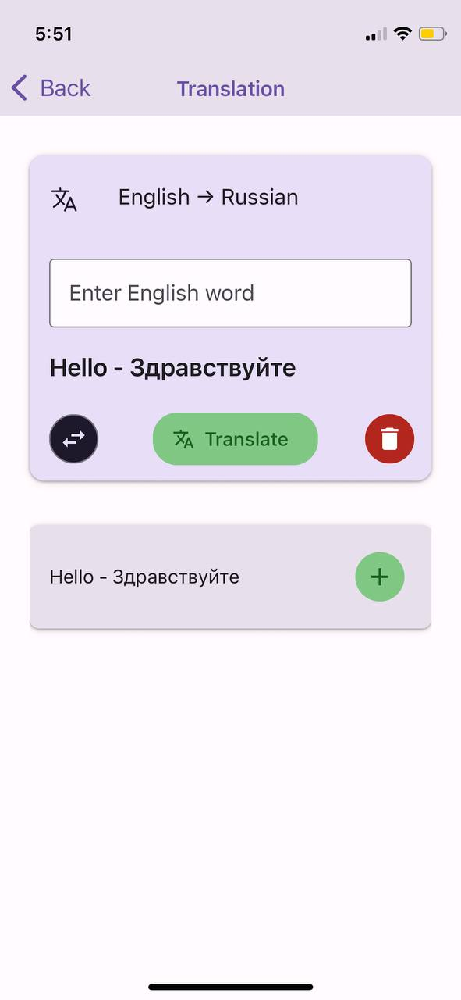

## Screenshots & UI gallery

Use this document to showcase the most important screens of **LearningEng**.

### Suggested screenshots

- **Dashboard / Profile**
  - Daily goal, progress cards, and quick access to settings.
- **Learn & Review Words tab**
  - Learning card UI with a word, translation, and actions.
  - Review flow for previously learned words.
  - Optional practice modes (e.g. word pairs, word building) if you want to showcase them.
- **Vocabulary tab**
  - Category list screen.
  - Word list screen with add/edit dialogs.
- **Translation helper**
  - Input fields, direction toggle, and history of translations.

### Example

| | | |
| --- | --- | --- |
|  |  |  |
|  |  |  |